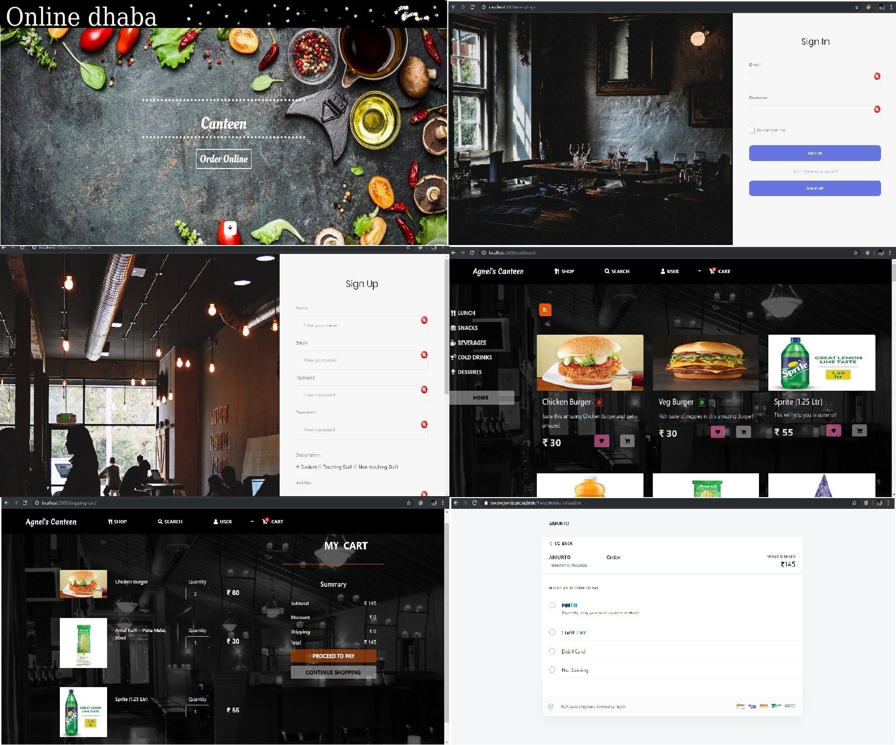
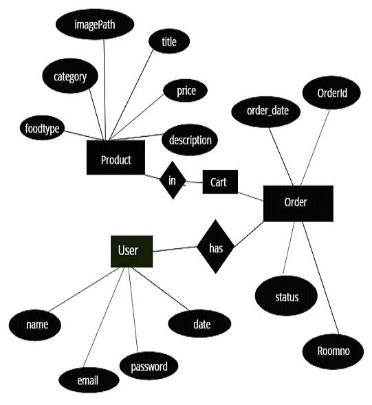

# Online Dhaba

# Table of Contents

# Description

The Project "Online Dhaba" enables the end users to register online, read and select the food from e-menu card and order food online by just selecting the food that the user want to have using android application. The results after selecting the food from the E-menu card will directly appear on the screen near the Chef who is going to cook the food for you. 

By using this application the work of the waiter is reduced and we can also say that the work is nullified. The benefit of this is that if there is a rush in the restaurant/canteen then there will be chances that the waiters will be unavailable and the users can directly order the food to the chef online by using this application. The user will have a username and a password, by using which they can login into the system. This implies that the customer is the regular user of the Canteen.

Nowadays people don't have much time to spend in canteen by just there and waiting for the waiter to take their order. Many customers visit the canteen in their lunch break and recess so they have limited time to eat and return to their respective office and colleges. So this software helps them to save time and order food whenever they want without calling the waiter again and again.

 
### Website Images

### ER Diagram

